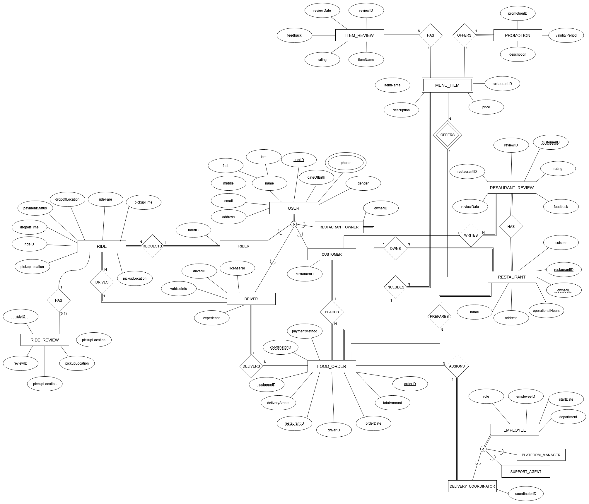

# 🚀 GlobalRides Database Design



A comprehensive relational database schema and implementation for **GlobalRides**, an Uber-and-UberEats-style platform connecting riders, drivers, customers, restaurants, and employees.

## 🎯 Project Overview

GlobalRides operates two core services:
1. **Ride-Hailing**: Matching riders with drivers.
2. **Food Delivery**: Enabling customers to order from local restaurants.

This project covers:
- Complete **EER Model** with superclass/subclass hierarchies for Users and Employees.
- **Relational Schema** implementing all entities and relationships.
- Business-rule enforcement via **constraints** and **triggers**.
- A suite of **SQL scripts**: schema creation, views, and analytics queries.

## 🗂️ Key Components

| Component            | Location                                   |
|----------------------|--------------------------------------------|
| Entity–Relationship  | `diagrams/GlobalRides_ERD.png`             |
| Relational Schema    | `schema.sql`                               |
| Business Rules       | `WriteUp.pdf` (Phase 4 Project Report)     |
| Views                | `create_view.sql`                          |
| Analytics Queries    | `sql_queries.sql`                          |

### Core Entities

- **Users**: Single table for all people on the platform (riders, customers, drivers, owners).
- **Employees**: Superclass with subtypes _PlatformManagers_, _SupportAgents_, _DeliveryCoordinators_.
- **Rides & Ride_Reviews**: Tracks each ride and feedback.
- **Restaurants, Menu_Items, Promotions, Promotion_Items**.
- **Food_Orders & Order_Items**, with _Restaurant_Reviews_ and _Item_Reviews_.
- **Drivers**, **Customers**, **Restaurant_Owners**.

### Highlights

- **Inheritance** for users and employees reduces redundancy.
- **Composite PKs** for multi-valued and many-to-many relationships (e.g., phones, promotion items).
- **CHECK** constraints for data integrity (`rating BETWEEN 0 AND 5`, positive `quantity`).
- **Auto-increment PKs** for ease of record creation.
- **Views** to surface business insights (e.g., LoyalCustomers, ActiveDrivers, PopularMenuItems).
- **Analytical Queries** for earnings, spending, utilization, and more.

## 🛠️ Getting Started

### Prerequisites

- MySQL 8.0+ (or compatible RDBMS)
- SQL client (MySQL Workbench, DBeaver, etc.)

### Installation

1. **Clone** this repo  
   ```bash
   git clone https://github.com/<your-username>/GlobalRides-DB.git
   cd GlobalRides-DB
